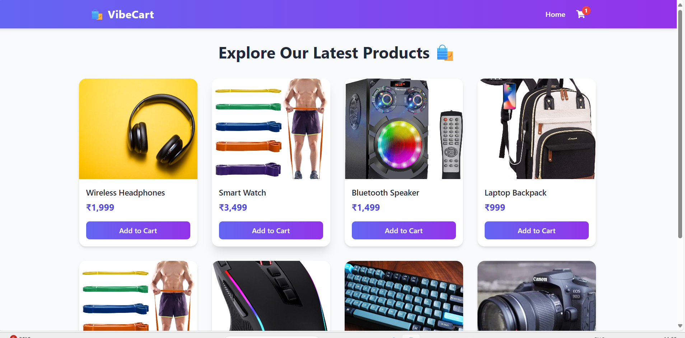
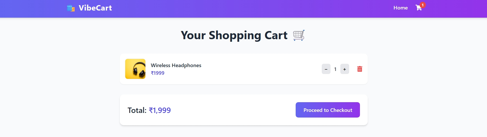
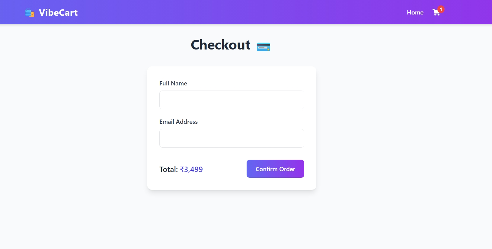

# 🛒 Mock E-Commerce Cart (React + Node.js)

A simple full-stack shopping cart web app built using **React (frontend)** and **Node.js + Express (backend)**.  
It allows users to view mock products, add/remove items from the cart, update quantities, and checkout.

---

## 🚀 Features

✅ View mock products (5–10 sample items)  
✅ Add products to cart  
✅ Update quantity or remove items  
✅ View total amount dynamically  
✅ Checkout with mock receipt  
✅ Persistent cart data (saved even after refresh)  
✅ Clean, modern UI with **Tailwind CSS**  
✅ Backend API routes for `products`, `cart`, and `checkout`  

---

## 🧩 Tech Stack

**Frontend:** React, React Router, Tailwind CSS  
**Backend:** Node.js, Express  
**Database:** None (mock JSON data)  
**Tools:** Git, npm

---

## Full Installation & Run Setup

# 🌀 1. Clone the project
git clone https://github.com/santuguddu/mock-ecom.git
cd mock-ecom

# ⚙️ 2. Install root dependencies
npm install concurrently --save-dev

# 🧠 3. Setup Backend
cd backend
npm init -y
npm install express cors body-parser
cd ..

# 💻 4. Setup Frontend
cd frontend
npm install
cd ..

# 🛠️ 5. Root package.json setup (make sure it has this)
# (If already there, skip this step)
echo '{
  "name": "mock-ecom-cart",
  "version": "1.0.0",
  "description": "Mock E-commerce Cart using React + Node.js",
  "main": "index.js",
  "scripts": {
    "start": "concurrently \"npm run server\" \"npm run client\"",
    "server": "cd backend && node server.js",
    "client": "cd frontend && npm run dev"
  },
  "author": "Santosh",
  "license": "ISC",
  "devDependencies": {
    "concurrently": "^9.2.1"
  }
}' > package.json

# 🚀 6. Start both frontend & backend together
npm start

# screenshots

## 📸 Screenshots

### 🏠 Home Page

### 🛒 Cart Page

### 💳 Checkout Page

# Demo video of the project 

## 🎥 Demo

